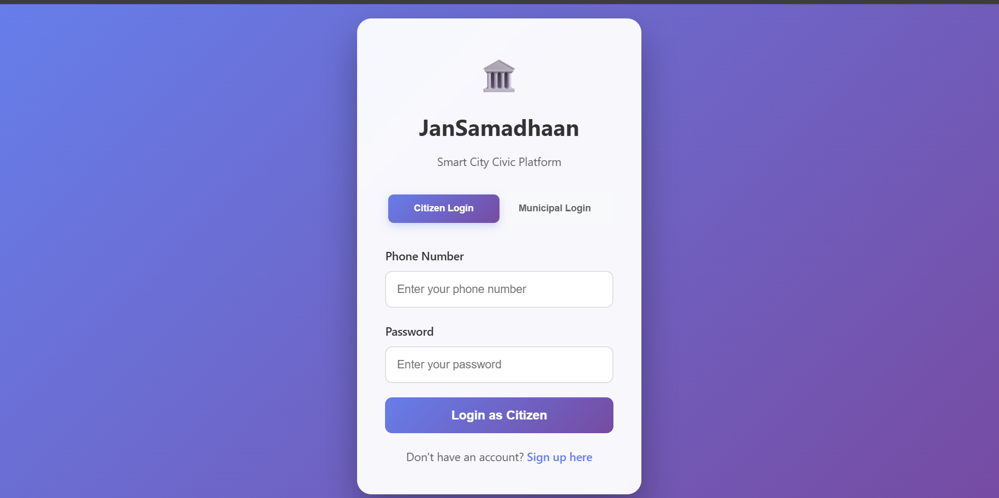
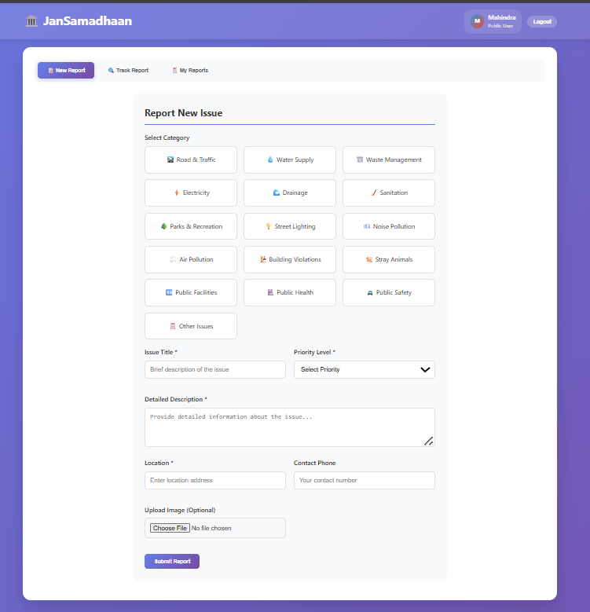
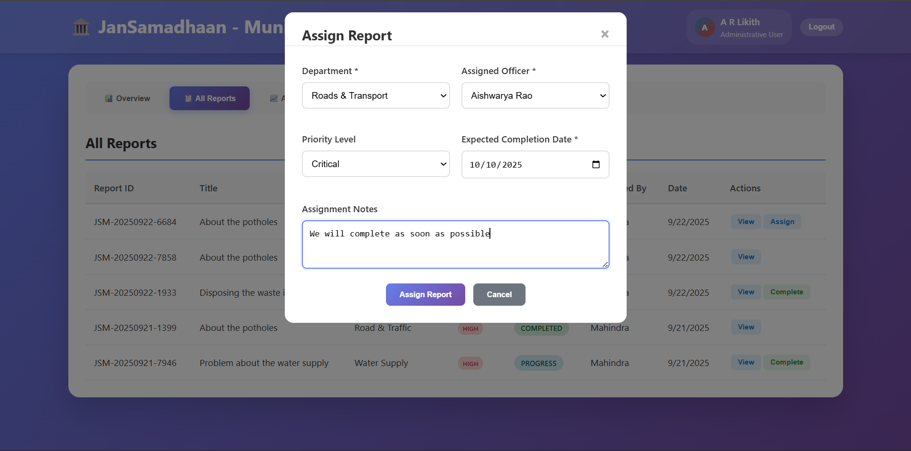
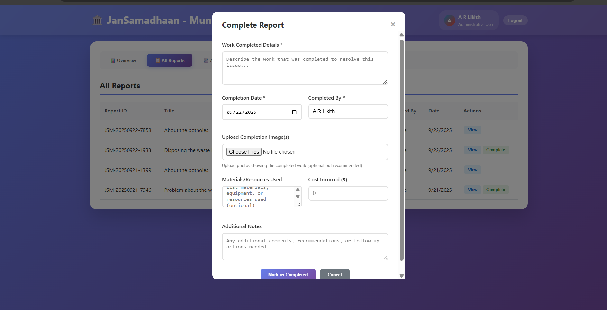

# JanSamadhaan--Smart-City-Civic-Platform

<h1>About</h1>

JanSamadhaan, is an integrated platform featuring a citizen
facing mobile app and a municipal web dashboard for end-to-end civic issue 
resolution

Citizens can submit issues in under 60 seconds using a mobile-first 
interfacethat captures photos, voice notes, and automated, high-precision 
geo-tags.
All submissions populate a centralized GIS Dashboardfor authorities, 
providing a real-time, city-wide operational view with tools for workflow 
management and departmental assignment

<h1>Features</h1>

<h3>1.Login and Register</h3>

It has two dashboards one for citizen and another one for Authority.

<h3>2.Citizen Dashboard</h3>

Here the user can report a new issue. There will be a poassible problems as categories that occurs in the public area.The user has to select the category,giving the detailed description about the problem ,location and uploading the image.

<h3>3.Realtime Tracking</h3>

Users can track their report using the unique report id

<h3>4.Viewing the submitted report</h3>

Users can view their submitted reports

<h3>5.Municipal Dashboard</h3>

Here the Administartor can view the reports issued by the citizens. they have to assign the work to the particular department

<h3>6.Assigning the Work</h3>

The Muncipal administrator assigns the work to particular department and officer

<h3>7.Complete Report</h3>

After the completion of work the administartor must fill the completion report by attaching the image,work details and cost

